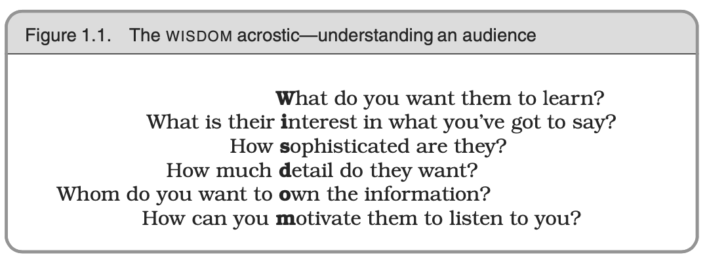
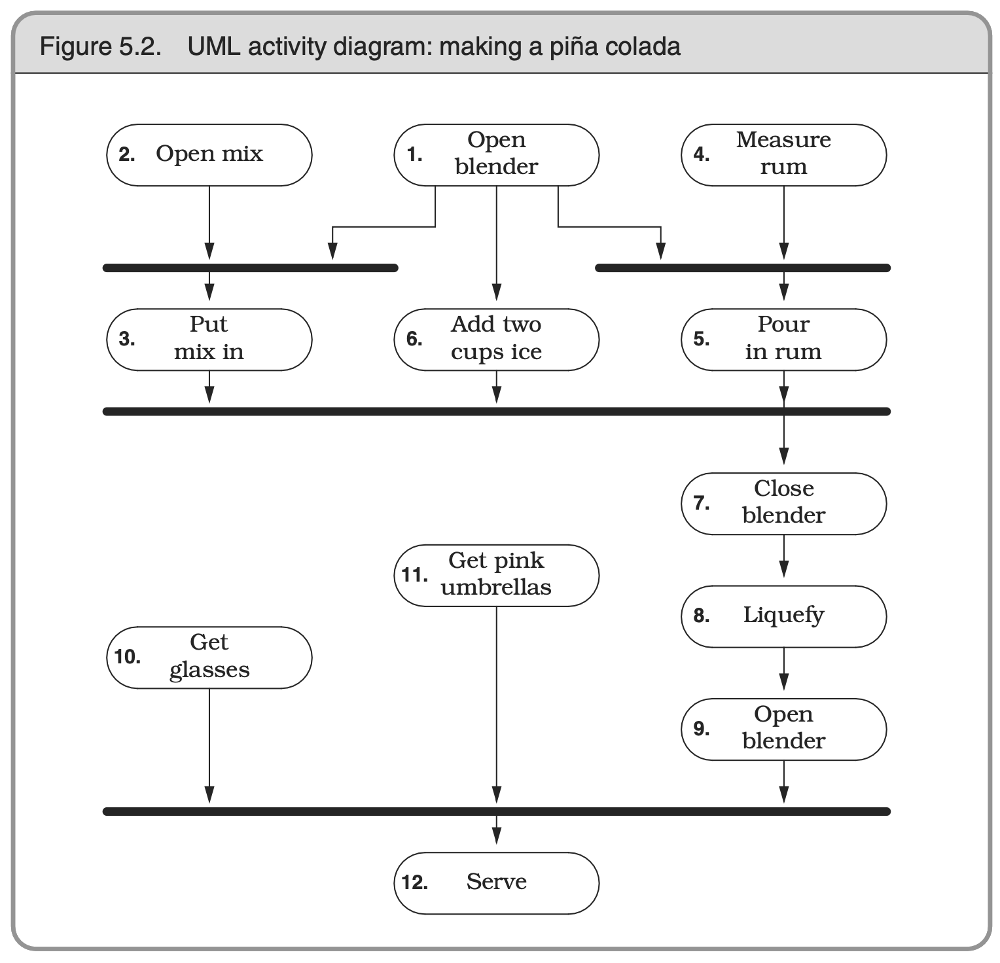
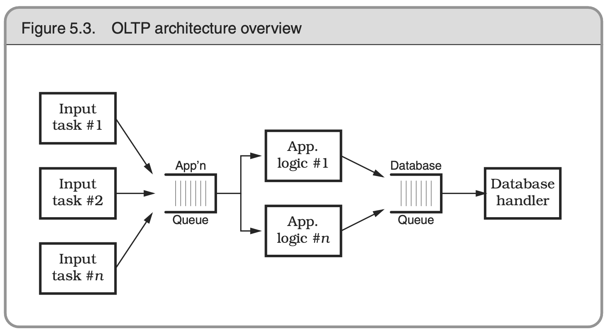
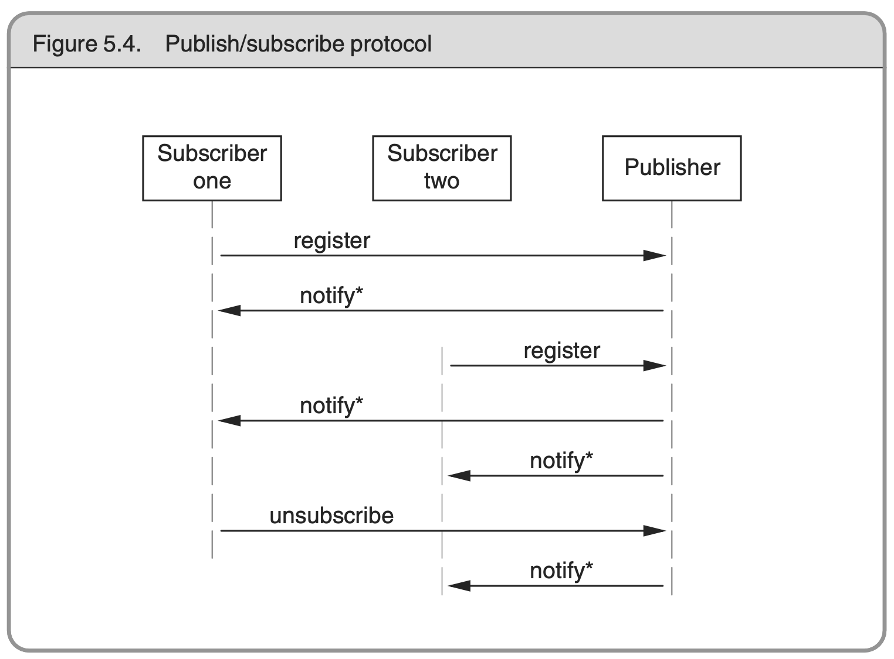
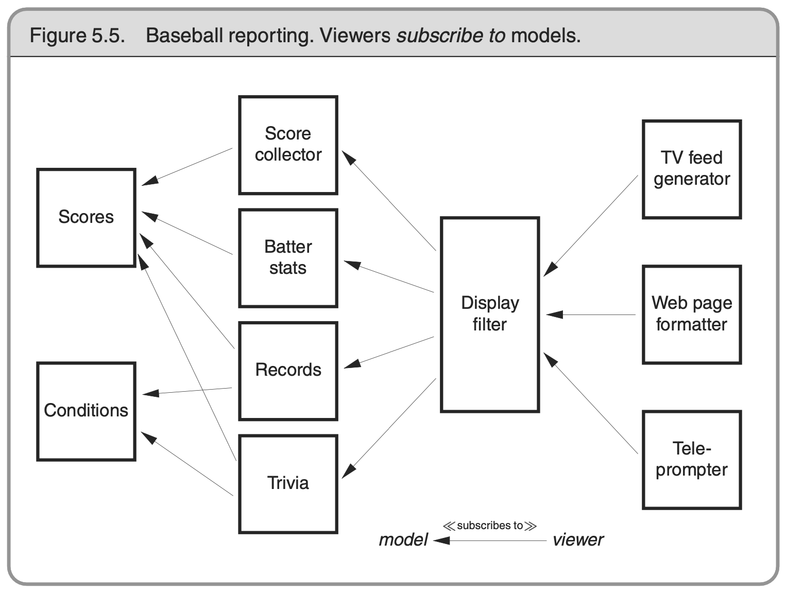

## CH 1. A Pragmatic Philosophy

- Broken window theory: Neglect accelerates the rot faster
- Your knowledge Portfolio:
  - Continue investing is the key
  - The process of learning will expand your thinking, new way for doing thing
  - Don't let challenge stop there
  - Critically analyze what you read and hear
- Communicate:
  - If you don't listen to them, they won't listen to you
  - Encourage people to talk by asking questions
  - Sometimes all it takes is the simple question "Is this a good time to talk about..."
  - 

## CH 2. A Pragmatic Approach

### The Evils of Duplication

- **DRY principle (Don't Repeat Yourself)**: Every piece of knowledge must have a single unambiguous, authoritative representation within a system
  - Make it easy to reuse
  - Short cuts make for long delays

  - eg. duplicate code:

  ```cpp
  class Line {
    public:
      Point start;
      Point end;
      // The length is defined by the start and end points: change one of the points and the length changes
      // better to make the length a calculated field: double length() { return start.distanceTo(end); }
      double length;
  };
  ```
  - Where possible, always use accessor functions to read and write the attributes of objects. It will make it easier to add functionality, such as caching, in the future

### Orthogonality

- **Orthogonality** in programming: Two or more things are orthogonal if changes in one do not affect any of the others
- Benefits
  1. Increased productivity
    - Changes are localized
    - Promotes reuse
    - Get more functionality per unit effort by combining orthogonal components
  2. Reduced risk
    - Diseased sections of code are isolated
    - The resulting system is less fragile
    - Better tested
    - Won't be tightly tied to a particular thing (eg. vendor, product, or platform)
- Orthogonality is also important for projects team
  - When teams are organized with lots of overlap, members are confused about responsibilities
- Design
  - Layer system is powerful way to design orthogonal systems
    - Each layer uses only the abstractions provided by the layers below it
  - Ask yourself "If I dramatically change the requirements behind a particular function, how many modules are affected"
    - In an orthogonal system, the answer should be "one"
  - Ask yourself how decoupled your design is from changes in the real world
    - Don't rely on the properties of things you can't control (eg. don't use the telephone as customer id)
- Toolkits and Libararies
  - When you bring in a toolkit, ask yourself whether it imposes changes on your code that shouldn’t be there
    - Isolate the imposed change will make it easier (eg. EJB transaction related logic, AOP logging)
- Code
  - Keep your code decoupled
    - eg. If you need to change an object’s state, get the object to do it for you
  - Avoid global data
    - eg. Singleton pattern
    - Your code is easier to understand and maintain if you explicitly pass any required context into your modules
  - Avoid similar functions
    - Can check strategy pattern for a better implementation
- Testing
  - Module level (or unit) testing is considerably easier to specify and perform than integration testing
  - Building unit tests is itself an interesting test of orthogonality
  - Bug fixing is also a good time to assess the orthogonality of the system as a whole
- Documentation
  - The axes are content and presentation
  - With truly orthogonal documentation, you should be able to change the appearance dramatically without changing the content
- Orthogonality is closely related to the **DRY** principle

### Reversibility

- There are no final decisions
- Hide a third-party product behind a well-defined, abstract interface

### Tracer Bullets

- Use tracer bullets to find the target
- Tracer code approach: Initially simply achieved an end-to-end connection among the components of your system
- Beneifits:
  - Users get to see something working early
  - Developers build a structure to work in
  - You have an integration platform
  - You have something to demonstrate
  - You have a better feel for progress
- Tracer bullets might bot always hit target, you then adjust your aim until they're on target
- Think of prototyping as the reconnaissance and intelligence gathering that takes place before a single tracer bullet is fired

### Prototypes and Post-it Notes

- We build software prototypes to analyze and expose risk, and to offer chances for correction at a greatly reduced cost
- Prototypes no need to be code-based, other format also ok, eg. post-it notes, index card, workflow, application logic, drawing...
- If you find yourself cannot give up the details, then you need to ask yourself if you are really building a prototype at all
  - Can consider switching to **tracer bullet** instead
- You can prototype anything you are not sure, not comfortable with, haven't tried before, or very critical to the final system
- Prototyping is a learning experience, its value is in the lessons learned
- Some specific area in the architectural prototype:
  - Are the responsibilities of the major components well defined and appropriate?
  - Are the collaborations between major components well defined?
  - Is coupling minimized?
  - Can you identify potential sources of duplication?
  - Are interface definitions and constraints acceptable?
  - Does every module have an access path to the data it needs during execution? Does it have that access when it needs it? (most valuable)

### Domain Languages

- You can design a mini-language which let you program close to the problem domain
- eg. the word below can be translate to a language

```
Listen for transactions defined by ABC Regulation 12.3 on a set of X.25 lines, translate them to XYZ Company’s format 43B, retransmit them on the satellite uplink, and store for future analysis


From X25LINE1 (Format=ABC123) {
  Put TELSTAR1 (Format=XYZ43B);
  Store DB;
}
```

- By coding at a higher level of abstraction, you are free to concentrate on solving domain problems, and can ignore petty implementation details
- Each people/user has their own problem domain, can generate mini-environments and languages for all of them
- To implement a mini-language, first using a notation such as **BNF** to define the syntax and have grammer specified
  - There’s another way of implementing a mini-language: extend an existing one
- Implemented languages can be used in 2 different ways:
  - **Data Languages**: produce some form of data structure, often used to represent configuration information
  - **Imperative languages**: the language is actually executed, more like an interface to help connect systems/components, eg. screen scraping
  ```
  locate prompt "SSN:"
  type "%s" social_security_number
  type enter
  waitfor keyboardunlock
  if text_at(10,14) is "INVALID SSN" return bad_ssn
  if text_at(10,14) is "DUPLICATE SSN" return dup_ssn
  # etc...
  ```
    - It is common to embed high-level imperative languages directly into your application, so that they execute when your code runs

### Estimating

- Estimate to avoid surprises
- Choose the units of your answer to reflect the accuracy you intend to convey:
  | Duration | Register ID|
  |:-----|:------|
  | 1-15 days | days |
  | 3-8 weeks | weeks |
  | 8-30 weeks | months |
  | 30+ weeks | think hard before giving an estimate |
- Before you get too committed to model building, cast around for someone who’s been in a similar situation in the past
- From your understanding of the question being asked, build a rough and ready bare-bones mental model
  - Often, the process of building the model leads to discoveries of underlying patterns and processes that weren’t apparent on the surface
- Once you have a model, you can decompose it into components
  - You’ll need to discover the mathematical rules that describe how these components interact
  - You’ll find that each component will typically have parameters that affect how it contributes to the overall model
  - At this stage, simply identify each parameter
- Once you have the parameters broken out, you can go through and assign each one a value
  - The trick is to work out which parameters have the most impact on the result, and concentrate on getting them about right
  - Typically, parameters whose values are added into a result are less significant than those that are multiplied or divid
- Run multiple calculations, varying the values of the critical parameters, until you work out which ones really drive the model
- When an estimate turns out wrong, don’t just shrug and walk away. Find out why it differed from your guess
  - Next time will be better
- The only way to determine the timetable for a project is by gaining experience on that same project
- Repeating the following steps to refine the estimate:
  - Check requirement
  - Analyze risk
  - Design, implement, inegrate
  - Validate with the users

## CH 3. The Basic Tools

### The Power of Plain Text

- Benefits for using plain text to store information:
  - **Insurance Against Obsolescence**
    - As long as the data survives, you will have a chance to be able to use it
  - **Leverage**
    - Every tool in the computing universe can operate on plain text
  - **Easier Testing**

### Shell Games

- A benefit of GUIs is WYSIWYG—what you see is what you get. The disadvantage is WYSIAYG—what you see is all you get.
- The scope of any one tool is usually limited to the tasks that the tool is expected to perform
- By programming the shell, you can build complex macro commands for activities you perform often

### Power Editing

- Choose an editor, know it thoroughly, and use it for all editing tasks

### Source Code Control

- It’s a giant UNDO key—a project-wide time machine
- Beside the UNDO, can answer the question or have beneifits below:
  - Who made changes in this line of code?
  - What’s the difference between the current version and last week’s?
  - How many lines of code did we change in this release?
  - Which files get changed most often?
  - Identify releases of your software

### Debugging

- Embrace the fact that debugging is just problem solving, and attack it as such
- In the technical arena, you want to concentrate on fixing the problem, not the blame
- The first rule of debugging - **Don't Panic**
- A very simple but particularly useful technique for finding the cause of a problem is simply to explain it to someone else
- The amount of surprise you feel when something goes wrong is directly proportional to the amount of trust and faith you have in the code being run
  - You must realize that one or more of your assumptions is wrong
  - Don’t Assume It—Prove It. Prove it in this context, with this data, with these boundary conditions

### Text Manipulation

- Learn a text manipulation language, eg. Perl, Python

### Code Generators

- **Passive code generator**: Run once to produce a result
  - Once the result is produced, it becomes a full-fledged source file in the project; it will be edited, compiled, and placed under source control just like any other file
  - Usage Examples:
    - Creating new source files, eg. templates, source code control directives, copyright notices, and standard comment blocks
    - Performing one-off conversions among programming languages
    - Producing lookup tables and other resources
- **Active code generator**: Used each time their results are required, help get rid of duplicate code
  - With an active code generator, you can take a single representation of some piece of knowledge and convert it into all the forms your application needs
  - Are a necessity if you want to follow the DRY principle
  - Whenever you find yourself trying to get two disparate environments to work together, you should consider using active code generators
    - eg. database schema in code & certain database table - will violates the DRY principle
      - Use active code generate to fetch schema and generate source code automatically
      - Schema change, the code used to access it also changes, automatically (only if you make the code generation part of the build process itself)
    - eg. different programming languages are used in the same application
      - In order to communicate, each code base will need some information in common - data structure, message formats, etc
      - Rather than duplicate this information, use a code generator
- Keep the input format simple, and the code generator becomes simple
- Not only source code, code generators can also be used to write about any output: HTML, XML, plain text—any text that might be an input somewhere else in your project

## CH 4. Pragmatic Paranoia

- When everybody actually is out to get you, paranoia is just good thinking   ---Woody Allen

### Design by Contract (DBC)

- What is a correct program? One that does no more and no less than it claims to do
  - Documenting and verifying that claim is the heart of Design by Contract
- Expectations and claims:
  - **Preconditions**: The routine’s requirements. A routine should never get called when its preconditions would be violated
  - **Postconditions**: The state of the world when the routine is done. The fact that the routine has a postcondition implies that it will conclude
  - **Class invariants**: Condition is always true from the perspective of a caller (Invariants might not be hold during internal processing, but must true by the time routine exits and control returns to the caller)
- If all the routine’s preconditions are met by the caller, the routine shall guarantee that all postconditions and invariants will be true when it completes
- If either party fails to live up to the terms of the contract, then a remedy (which was previously agreed to) is invoked—an exception is raised, or the program terminates, for instance
- 
- eg. contract for a routine that inserts a data value into a unique, ordered list:

``` java
/** 
 * @invariant forall Node n in elements() |
 *      n.prev() != null
 *        implies
 *          n.value().compareTo(n.prev().value()) > 0
 */
public class dbc_list {
  /**
   * @pre contains(aNode) == false
   * @post contains(aNode) == true
   */
  public void insertNode(final Node aNode) {
    // ...
  }
  // ...
}
```

- Here, we use the Java keyword **final** to indicate our intentions that the parameter shouldn’t be changed within the method since precondition will use `aNode` to verify correct behavior
- The emphasis is on "lazy" code: Be strict in what you will accept before you begin, and promise as little as possible in return
- Subclass must accept at least as much, and guarantee as much, as its parent
- DBC fits in nicely with out concept of crashing early
- If there is no built-in support, it should be the **caller's responsibility** to checks these assertions
- It’s much easier to find and diagnose the problem by crashing early, at the site of the problem
- Beside class, other uses of invariants:
  - **Loop Invariants**:
    ``` java
    int m = arr[0]; // example assumes arr.length > 0 int i = 1;
    // Loop invariant: m = max(arr[0:i-1])
    while (i < arr.length) {
      m = Math.max(m, arr[i]); i = i + 1;
    }
    ```
  - **Semantic Invariants**:
    - Express inviolate requirements, a kind of "philosophical contract"
    - Clear, concise, unambiguous statement that’s applicable in many different areas of the system

### Dead Programs Tell No Lies

- When your code discovers that something that was supposed to be impossible just happened, your program is no longer viable
- A dead program normally does a lot less damage than a crippled one

### Assertive Programming

- If it can't happen, use assertionss to ensure that it won't
- Don't use assertions in place of real error handling. Assertions check for things that should never happen: you don’t want to be writing code such as:

```c
printf("Enter ’Y’ or ’N’: ");
ch = getchar();
assert((ch == ’Y’) || (ch == ’N’)); /* bad idea! */
```

### When to Use Exceptions

- See the benefits of exceptions on the code below:

```java
// code w/o exception
retcode = OK;
if (socket.read(name) != OK) {
  retcode = BAD_READ;
}
else {
  processName(name);
  if (socket.read(address) != OK) {
    retcode = BAD_READ;
  } else {
    processAddress(address);
    if (socket.read(telNo) != OK) {
      retcode = BAD_READ;
    } else {
      // etc, etc...
    } 
  }
}
return retcode;

// code with exception
retcode = OK;
try { 
  socket.read(name);
  process(name);
  socket.read(address);
  processAddress(address);
  socket.read(telNo);
  // etc, etc...
} catch (IOException e) {
  retcode = BAD_READ;
  Logger.log("Error reading individual: " + e.getMessage());
}
return retcode;
```

- Exceptions should rarely be used as part of a program’s normal flow; exceptions should be reserved for unexpected events
- Use exceptions for exceptional problems
- Exception will be generated under only truly exceptional circumstances, otherwise error return will be appropriate
- Programs that use exceptions as part of their normal processing suffer from all the readability and maintainability problems of classic spaghetti code
  - Exception represents an immediate, nonlocal transfer of control—it’s a kind of cascading goto
  - These programs break encapsulation: routines and their callers are more tightly coupled via exception handling
- Error handlers are an alternative to exception:
  - eg. wrap an object which potentially throw exception in handler, so other modules which call this object can rely on this handler, and no need to handle these exception by themselvies

### How to Balance Resources

- **Finish What You Start**
  - eg. the routine that allocates a resource should also free it
- Suggestions for resource allocation
  - Deallocate resources in the opposite order to that in which you allocate them, you won’t orphan resources if one resource contains references to another
  - When allocating the same set of resources in different places in your code, always allocate them in the same order, this will reduce the possibility of deadlock
- Exception handling in C++:
  ```cpp
  void doSomething(void) {
    Node *n = new Node;
    try {
      // do something
    } catch (...) {
      delete n;
      throw;
    }
    delete n;
  }
  ```
  - Violate the DRY principle
  - We can change `n` from a pointer to an actual Node object on the stack (will be auto cleanup when function return):
  ```cpp
  void doSomething(void) {
    Node n;
    try {
      // do something
    } catch (...) {
      throw;
    }
  }
  ```
  - If switch from a pointer is not possible, we can wrap the resource within another class:
  ```cpp
  // Wrapper class for Node resources
  class NodeResource {
    Node *n;
    public:
      NodeResource() { n = new Node; }
      ~NodeResource() { delete n; }
      Node *operator->() { return n; }
  };

  void doSomething2(void) {
    NodeResource n;
    try {
      // do something
    } catch (...) {
      throw;
    }
  }
  ```
  - Because this technique is so useful, the standard C++ library provides the template class auto_ptr, which gives you automatic wrappers for dynamically allocated objects
  ```cpp
  void doSomething3(void) {
    auto_ptr<Node> p (new Node);
    // Access the Node as p->...
    // Node automatically deleted at end
  }
  ```
- Producing wrappers for each type of resource, and using these wrappers to keep track of all allocations and deallocations, especially the top single entry point

## CH 5. Bend, or Break

### Decoupling and the Law of Demeter

- Example for coupling module:

```java
public void plotDate(Date aDate, Selection aSelection) {
  TimeZone tz = aSelection.getRecorder().getLocation().getTimeZone();
  ...
}
```
- It increases the risk that an unrelated change somewhere else in the system will affect your code
  - eg. `Location` such that it no longer directly contains a `TimeZone`, you have to change your code as well
- A better way is ask for what you need directly:

```java
public void plotDate(Date aDate, TimeZone aTz) {
  ...
}
plotDate(someDate, someSelection.getTimeZone());
```

- The Law of Demeter for functions attempts to **minimize coupling between modules** in any given program


- Cost of law of demeter: your module must delegate and manage any and all subcontractors directly, without involving clients of your module. You will be writing a large number of wrapper methods that simply forward the request on to a delegate

- Examples which violate Law of Demeter:
```java
// bad
public void showBalance(BankAccount acct) {
  // Allowed, acct is passed in as a parameter
  Money amt = acct.getBalance();

  // Not Allowed, we don't own amt
  printToScreen(amt.printFormat());
}

// good
public void showBalance(BankAccount acct) {
  acct.printBalance();
}
```

```cpp
void processTransaction(BankAccount acct, int) {
  Person *who;
  Money amt;
  // Allowed, we own amt
  amt.setValue(123.45);

  // Allowed, acct is passed in as a parameter
  acct.setBalance(amt);
  who = acct.getOwner();

  // Not Allowed, we don't own who
  markWorkflow(who->name(), SET_BALANCE);

  // better one
  // markWorkflow(acct.name(), SET_BALANCE);
}
```

### Metaprogramming

- Configure, don't integrate
- Our goal is to think declaratively (specifying what is to be done, not how) and create highly dynamic and adaptable programs
- Put abstractions in Code, Details in Metadata
- Benefits:
  - Forces you to decouple your design, which results in a more flexible and adaptable program
  - Forces you to create a more robust, abstract design by deferring details
  - You can customize the application without recompiling it
  - Metadata can be expressed in a manner that’s much closer to the problem domain than a general-purpose programming language might be
  - You may even be able to implement several different projects using the same application engine, but with different metadata

### Temporal Coupling

- There are two aspects of time that are important to us:
  - Concurrency
  - Ordering
- Think in linear way leads to temporal coupling: coupling in time

#### Workflow

- Draw an activity diagram to analyze workflow to improve concurrency
- eg.



#### Architecture

- eg.



- This example also shows a way to get quick and dirty load balancing among multiple consumer processes: **the hungry consumer model**
  - Replace the central scheduler with a number of independent consumer tasks and a centralized work queue
  - If any particular task gets bogged down, the others can pick up the slack, and each individual component can proceed at its own pace
  - Each component is temporally decoupled from the others

#### Design for Concurrency

- Concurrency forces you to think through thingss a bit more carefully
  - Ask yourself why you need a global variable in the first place
  - You need to make sure that you present consistent state information, regardless of the order of calls
  - You must ensure that an object is in a valid state any time it could possibly be called
- Always design for concurrency

### It's Just a View

- We want module to hear what it wants to hear and disregards the rest
- Using events can minimizes coupling between those objects-the sender of the event doesn't need to have any explicit knowledge of the receiver
- Publish/subscribe protocal:



- We can use this publish/subscribe mechanism to implement a very important design concept: **the separation of a model from views of the model**

#### Model-View-Controller

- Key concept behind MVC idiom: Separating the model from both the GUI that represents it and the controls that manage the view
- Benefits:
  - Support multiple views of the same data model
  - Use common viewers on many different data models
  - Support multiple controllers to provide nontraditional input mechanism
- Most important ways of maintaining reversibility
- The view is an interpretation of the model (perhaps a subset) - it doesn't need to be graphical

- Model-viewer network:
  - Each model may have many viewers, and one viewer may work with multiple models
  - Each link decouples raw data from the events that created it—each new viewer is an abstraction



### Blackboards

- Use blackboards to coordinate workflow
- We can use the blackboard to coordinate disparate facts and agents, while still maintaining independence and even isolation among participants

## CH 6. While You Are Coding

### Programming by Coincidence

- Sometime we don't know why the code is failing because we didn't know why it worked in the first place
  - It seemed to work, given the limited "testing", but that was just a coincidence
- For routines you call, rely only on documented behavior. If you can’t, for whatever reason, then document your assumption well
- It’s easy to assume that X causes Y, but as we said in Debugging: **don’t assume it, prove it**
- Assumptions that aren't based on well-established facts are the bane of all projects
- Suggestion for program deliberately:
  - Always be aware of what you are doing
  - Don’t code blindfolded (don't build an application you don't fully understand, don't use a technology you arn't familiar with)
  - Proceed from a plan
  - Rely only on reliable things. Don’t depend on accidents or assumptions. If you can’t tell the difference in particular circumstances, assume the worst
  - Document your assumptions (Design by Contract can help clarify your assumptions in your own mind, as well as help communicate them to others)
  - Don’t just test your code, but test your assumptions as well
  - Prioritize your effort. Spend time on the important aspects; more than likely, these are the hard parts
  - Don’t be a slave to history. Don’t let existing code dictate future code. Don’t let what you’ve already done constrain what you do next—be ready to refactor

### Algorithm Speed

- The `O()` notation doesn’t apply just to time; you can use it to represent any other resources used by an algorithm
  - eg. memory consumption
- You also need to be pragmatic about choosing appropriate algorithms, the fastest one is not always the best for the job
  - eg. Given a small input set, a straightforward insertion sort will perform just as well as a quick sort
  - eg. Need to be careful if the algorithm you choose has a high setup cost

### Refactoring

- Rather than construction, software is more like gardening
- Rewriting, reworking, and re-architecting code is collectively known as refactoring
- Things may cause code to qualify for refactoring
  - **Duplication**: Violation of the DRY principle
  - **Nonorthogonal design**: You’ve discovered some code or design that could be made more orthogonal
  - **Outdated knowledge**: Things change, requirements drift, and your knowledge of the problem increases
  - **Performance**: You need to move functionality from one area of the system to another to improve performance

- Refactor early, reactor often
- Suggestions for refactoring:
  - Don't try to refactor and add functionality at the same time
  - Make sure you have good tests before you begin refactoring. Run tests as often as possible
  - Take short, deliberate steps

### Code That's Easy to Test

- We want to write test cases that ensure that a given unit honors its contract
  - whether the code meets the contract
  - whether the contract means what we think it means

- Test subcomponents of a module first. Once the subcomponents have been verified, then the module itself can be tested
  - We can quickly concentrate on the likely source of the problem

- Log messages should be in a regular, consistent format
  - You may want to parse them automatically to deduce processing time or logic paths that the program took

- Tests go in a particular place, and have a certain expected output, these 2 suggestion will make your life easier
- Testing is more cultural than technical; we can instill this testing culture in a project regardless of the language being used

## CH 7. Before the Project

### The Requirements Pit

- Don’t Gather Requirements—Dig for Them
  - Normally, they’re buried deep beneath layers of assumptions, misconceptions, and politics
  - Very few requirements are as clear-cut, and that’s what makes requirements analysis complex
- It’s important to discover the underlying reason why users do a particular thing, rather than just the way they currently do it
  - At the end of the day, your development has to solve their business problem, not just meet their stated requirements
- There’s a simple technique for getting inside your users' requirements that isn't used often enough: **become a user**
  - Work with a User to Think Like a User
- One way of looking at use cases is to emphasize their goal-driven nature


- eg.


- Use cases can contain hyperlinks to other use cases, and they can be nested within each other
- Good requirements documents remain abstract
  - Requirements are not architecture. Requirements are not design, nor are they the user interface. Requirements are need
- **Abstractions Live Longer than Details**
- The key to managing growth of requirements is to point out each new feature's impact on the schedule to the project sponsors
- Create and maintain a project glossary—one place that defines all the specific terms and vocabulary used in a project
  - All participants in the project, from end users to support staff, should use the glossary to ensure consistency

### Solving Impossible Puzzles

- The secret to solving the puzzle is to identify the real (not imagined) constraints, and find a solution therein
  - Some constraints are absolute; others are merely preconceived notions
  - Some apparent constraints may not be real constraints at all
- The key to solving puzzles is both to recognize the constraints placed on you and to recognize the degrees of freedom you do have, for in those you’ll find your solution
- When faced with an intractable problem, enumerate all the possible avenues you have before you. Don’t dismiss anything, no matter how unusable or stupid it sounds
- We want to identify the most restrictive constraints first, and fit the remaining constraints within them
- Some question can ask yourself when you feel you are in wrong way:
  - Is there an easier way?
  - Are you trying to solve the right problem, or have you been distracted by a peripheral technicality?
  - Why is this thing a problem?
  - What is it that's making it so hard to solve?
  - Does it have to be done this way?
  - Does it have to be done at all?
- All you need are the real constraints, the misleading constraints, and the wisdom to know the difference
